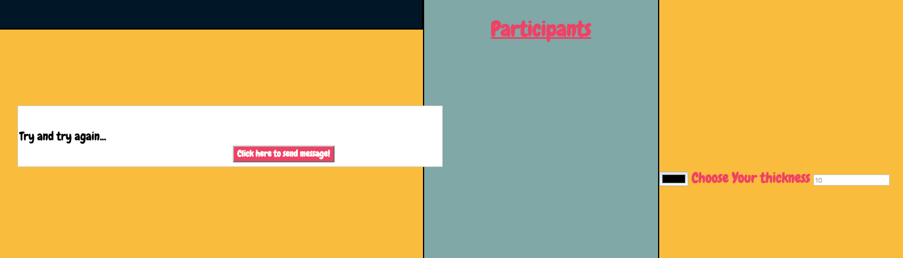

#Chat & Pictionary Appliction

###This is a Chat application that allows multiple users to interact with each other with the use of sockets, sharing client-to-server information/data. The users have the ability to play a pictionary game with each other as the drawn images display on all the screens of those playing the game. 


Visit here: [Chat app](http://shirletterly.com/chatapp/)

##Built with:
	- Html
	- CSS
	- Javascript
	- AngularJS
	- NodeJS
	- Socket.io

##Sample Code
###The following code utilizes socket.io to create the ability for the user to see corresponding information from whomever they are interacting with across the application. The socket information to the server and to the client creates functionality across multiple environments.

```javascript
// console.log(socket);
	console.log("Someone connected via a socket!");
	//Someone just changed their name
	socket.on('name_to_server', function(name){
		for (var i = 0; i < socketUsers.length; i++){
			if(socketUsers[i].socketID == socket.id){
				socketUsers[i].name = name;
				break;
			}
		}
		io.sockets.emit('users', socketUsers);
	});


	socket.on('message_to_server', function(data){
		io.sockets.emit('message_to_client', {
			message: data.message,
			name: data.name,
			date: data.date
			});
		});

	socket.on('drawing_to_server', function(drawingData){
		if(drawingData.lastMousePosition !== null){
		io.sockets.emit('drawing_to_client', drawingData);
		}
	})

```


####Early stages of the app


<!-- add a video of interaction with the site -->

##Future Add-ons
- Added integration of socket.io for user experience.
- Win and loose operations to complete the pictionary game element of the app.
- Ability to save the score and the data attributed to the winner and the winning game.


###Please visit my personal profile to see more current projects.
- [Shirlette Chambers](https://github.com/Shirlazybrat)
